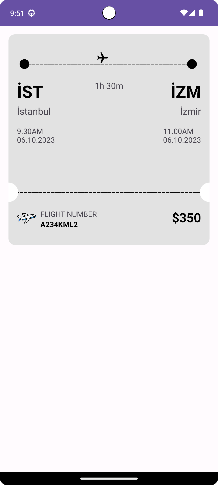

# Flight Ticket Card View
This can be used to display the flight ticket with details to your customers.

### Using in XML code
```xml

<com.example.flightticketcard.customviews.FlightTicketView
        android:id="@+id/ticket"
        android:layout_width="match_parent"
        android:layout_height="wrap_content"
        app:company_icon="@drawable/ic_airplane_comp"
        app:end_date_time="11.00AM\n06.10.2023"
        app:flight_number="A234KML2"
        app:flight_time="1h 30m"
        app:from="İstanbul"
        app:layout_constraintEnd_toEndOf="parent"
        app:layout_constraintStart_toStartOf="parent"
        app:layout_constraintTop_toTopOf="parent"
        app:price="$350"
        app:start_date_time="9.30AM\n06.10.2023"
        app:to="İzmir" />

```

### You can also change the attributes in your view where you use flight ticket card

```kt
binding.apply {
    ticket.setFromWhere("Adıyaman")
    ticket.setToWhere("İstanbul")
    ticket.setFlightNumber("GG013KFR")

    ticket.ticketBackgroundColor = R.color.bg
}

```
## Screenshot
</img>
